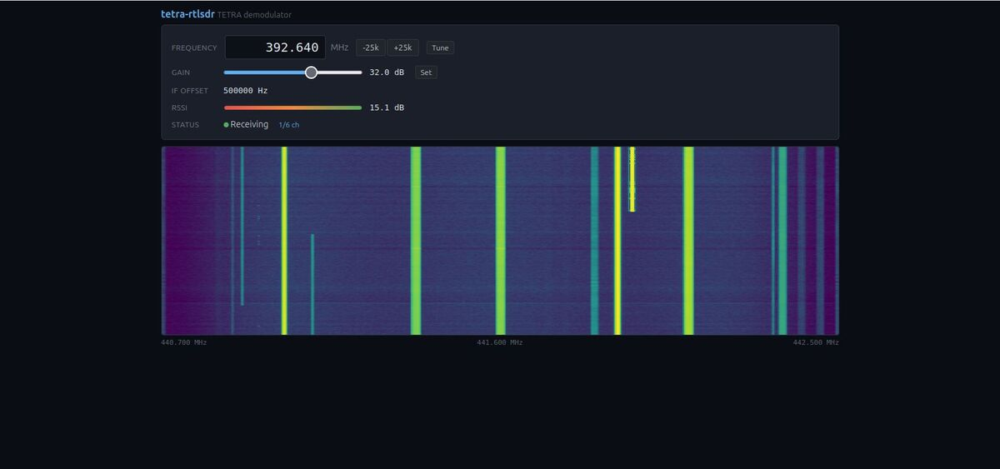
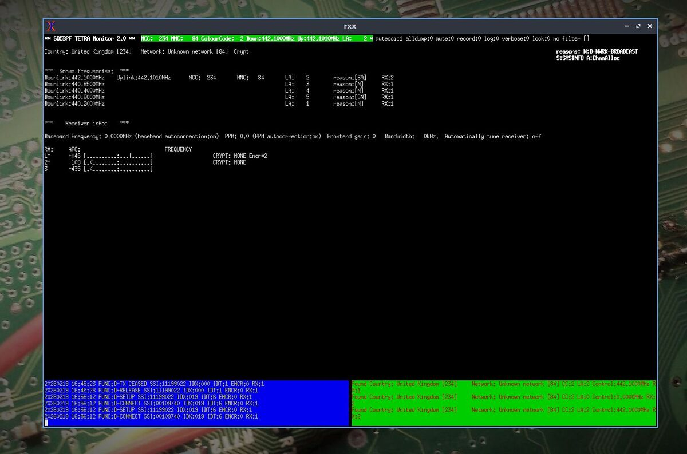

# tetra-rtlsdr

*This one's for you Rob and Carl*

RTL-SDR front-end for the [telive](https://github.com/sq5bpf/telive) /
[osmo-tetra-sq5bpf-2](https://github.com/sq5bpf/osmo-tetra-sq5bpf-2) TETRA
receiver stack by **Jacek Lipkowski SQ5BPF** (<sq5bpf@lipkowski.org>).

Replaces the GnuRadio + `simdemod3_telive.py` chain with a single C binary.
No GnuRadio installation required. Everything else in SQ5BPF's ecosystem
stays exactly as-is.

- Drop-in replacement for `simdemod3_telive.py` (99.2% sync detection parity)
- **Multi-channel:** auto-discover and demodulate up to 6 TETRA channels from one RTL-SDR
- **Scanner:** sweep a frequency range and find active TETRA channels
- **Web waterfall:** real-time spectrum display with click-to-tune
- **ASCII spectrum:** terminal-based spectrum display (no ncurses)
- **rtl_tcp:** stream IQ from a remote RTL-SDR over the network
- Just C, liquid-dsp, and librtlsdr

| Web waterfall | telive multi-channel |
|:---:|:---:|
|  |  |

---

## DragonOS Noble Quick Start

[DragonOS Noble](https://sourceforge.net/projects/dragonos-focal/) already
has `libliquid-dev` and `librtlsdr-dev` installed. You just need the TETRA
stack (`tetra-rx`, `telive`, speech codec) and tetra-rtlsdr.

**1. Install the TETRA stack** — follow
[this guide](https://github.com/sq5bpf/telive-2/pull/5) to build
`osmo-tetra-sq5bpf-2`, `telive-2`, and the TETRA speech codec on
DragonOS Noble.

**2. Build tetra-rtlsdr:**

```bash
git clone https://github.com/alphafox02/tetra-rtlsdr
cd tetra-rtlsdr
cmake -B build -DCMAKE_BUILD_TYPE=Release
cmake --build build
```

That's it. Now follow the steps below to scan, decode, and monitor TETRA.

---

## Step 1: Find TETRA Frequencies

If you don't know the TETRA frequencies in your area, scan for them:

```bash
./build/tetra-rtlsdr -S 380e6:400e6 -g 48 -D 3
```

This sweeps 380-400 MHz in 25 kHz steps (3 second dwell per step) and prints
every frequency where TETRA training sequences are detected:

```
[scan] Scanning 380.000 - 400.000 MHz  (step: 25 kHz, dwell: 3.0 s)

  *** 392.625 MHz  TETRA  matches=5  RSSI=-8.2 dB  MCC=234 MNC=78
  *** 392.960 MHz  TETRA  matches=3  RSSI=-12.1 dB

[scan] Done: 2 TETRA channel(s) found
```

> **Tips:**
> - Use high gain (`-g 48` or `-g 49.6`) to find weak signals.
> - TETRA downlink: 380-400 MHz (Europe), 410-430 MHz, 440-470 MHz in other regions.
> - Wider ranges take longer. Narrow it down first if you can.
> - `matches` = training sequence hits; `RSSI` = signal strength.

---

## Step 2: Decode a Single Channel

Once you have a frequency, decode it. You need two terminals.

**Terminal 1 — demodulate + decode:**
```bash
cd ~/osmo-tetra-sq5bpf-2/src
export TETRA_HACK_PORT=7379 TETRA_HACK_IP=127.0.0.1 TETRA_HACK_RXID=1
~/tetra-rtlsdr/build/tetra-rtlsdr -f 392.625e6 -g 48 | ./tetra-rx -r -s /dev/stdin
```

You should see decoded TETRA frames scrolling:
- `SYNC` — frame synchronization with MCC/MNC (network identity)
- `BNCH SYSINFO` — system info (DL/UL frequencies, services)
- `D-NWRK BROADCAST` — neighboring cell frequencies
- `BURST` / `AACH` — access assignment and traffic

**Terminal 2 — telive UI** (must be exactly 203x60):
```bash
xterm -geometry 203x60 -e "cd ~/Downloads/telive-2 && ./rxx"
```

telive shows network info, subscriber IDs, call activity, SDS messages,
and can play voice if the codec is installed.

---

## Step 3: Multi-Channel Mode

This is where it gets interesting. Instead of decoding one channel at a time,
multi-channel mode auto-discovers all TETRA channels within the RTL-SDR's
capture bandwidth and demodulates them simultaneously.

```bash
export TETRA_HACK_PORT=7379 TETRA_HACK_IP=127.0.0.1
~/tetra-rtlsdr/build/tetra-rtlsdr -f 392.625e6 -g 48 -T ~/osmo-tetra-sq5bpf-2/src/tetra-rx
```

What happens:
1. Starts decoding your specified frequency immediately (RXID=1)
2. Runs a background scan of the full capture bandwidth
3. Auto-adds channels where TETRA is detected (up to 6 total)
4. Each channel gets its own demod chain + tetra-rx process
5. All feed into telive — use Tab to switch between receivers

```
[multi] Channel 0: 392.625 MHz  RXID=1  NCO=+500000 Hz
[multi] Channel 1: 392.960 MHz  RXID=2  NCO=+835000 Hz
[multi] Channel 2: 392.300 MHz  RXID=3  NCO=+175000 Hz
```

Open telive in another terminal — you'll see multiple receivers (RX:1, RX:2, etc.)
with independent AFC, network info, and traffic.

### Multi-channel with known frequencies

If you already know the frequencies (from a previous scan), skip auto-discovery:
```bash
~/tetra-rtlsdr/build/tetra-rtlsdr -f 392.625e6,392.960e6,393.290e6 -g 48 \
  -T ~/osmo-tetra-sq5bpf-2/src/tetra-rx
```

### Limits

- Maximum 6 simultaneous channels
- All channels must fall within the capture bandwidth (1.8 MHz default,
  usable range ±720 kHz from center)
- Channels that land on the DC spike (RTL-SDR center frequency) are
  automatically skipped
- Set `TETRA_HACK_IP` and `TETRA_HACK_PORT` before running — child
  processes inherit them

---

## Web Spectrum Waterfall

Add `-w PORT` to get a real-time waterfall at `http://localhost:PORT/`.

```bash
# Waterfall + single channel
~/tetra-rtlsdr/build/tetra-rtlsdr -f 392.625e6 -g 48 -w 8080 | ./tetra-rx -r -s /dev/stdin

# Waterfall + multi-channel (click waterfall to add channels)
~/tetra-rtlsdr/build/tetra-rtlsdr -f 392.625e6 -g 48 -w 8080 -T ~/osmo-tetra-sq5bpf-2/src/tetra-rx
```

Features:
- Real-time FFT waterfall with Viridis color map
- Frequency and gain controls
- RSSI meter
- Click-to-tune (single channel) or click-to-add-channel (multi-channel)
- Channel count display in multi-channel mode

> In multi-channel mode, frequency retuning is disabled because changing the
> center frequency would break all active demod channels.

---

## ASCII Spectrum Display

The `-a` flag shows a live spectrum on stderr using Unicode block characters.
No ncurses dependency.

```bash
# Spectrum only
~/tetra-rtlsdr/build/tetra-rtlsdr -f 392.625e6 -g 48 -a > /dev/null

# Spectrum + multi-channel
~/tetra-rtlsdr/build/tetra-rtlsdr -f 392.625e6 -g 48 -a -T ~/osmo-tetra-sq5bpf-2/src/tetra-rx
```

Keyboard: `g`/`G` gain, `d`/`D` dynamic range, `r`/`R` reference level,
`a` auto-level, `q` quit, `h` help overlay.

---

## rtl_tcp Network Source

Stream IQ from a remote RTL-SDR over the network.

**Remote machine (where RTL-SDR is plugged in):**
```bash
rtl_tcp -a 0.0.0.0 -p 1234
```

**Local machine:**
```bash
# Single channel
~/tetra-rtlsdr/build/tetra-rtlsdr -f 392.625e6 -g 48 -n 192.168.1.50:1234 | ./tetra-rx -r -s /dev/stdin

# Multi-channel from remote RTL-SDR
~/tetra-rtlsdr/build/tetra-rtlsdr -f 392.625e6 -g 48 -n 192.168.1.50:1234 \
  -T ~/osmo-tetra-sq5bpf-2/src/tetra-rx
```

All features work over rtl_tcp. The protocol streams ~3.6 MB/s at 1.8 MSps.

---

## Architecture

**Single channel:**
```
tetra-rtlsdr                    tetra-rx              telive
(RTL-SDR → DQPSK → bits) ──> (decoder, SQ5BPF) ──> (UI, SQ5BPF)
```

**Multi-channel (`-T`):**
```
RTL-SDR (1.8 MHz capture)
  │
  └─ tetra-rtlsdr auto-scans bandwidth
       │
       ├─ demod[0] → FIFO → tetra-rx (RXID=1) ─┐
       ├─ demod[1] → FIFO → tetra-rx (RXID=2) ─┼─→ telive/rxx
       ├─ demod[2] → FIFO → tetra-rx (RXID=3) ─┘
       └─ ... up to 6 channels
```

**DSP chain (per channel):**
```
RTL-SDR IQ (uint8, 1.8 MSps)
  → NCO IF shift (avoids DC spike)
  → Kaiser LPF + decimation → 36 kSps
  → Feedforward AGC (must precede FLL)
  → Band-edge FLL carrier recovery (2nd-order PLL)
  → Polyphase RRC timing recovery (sps=2, α=0.35)
  → π/4-DQPSK differential decode
  → 1 byte per bit (0x00/0x01)
```

---

## Options

| Option | Description | Default |
|--------|-------------|---------|
| `-f FREQ` | Target frequency in Hz (e.g. `392.625e6`). Comma-separated for multi-freq. | **required** |
| `-g GAIN` | Tuner gain in dB (0 = auto, max ~49.6 for V4) | auto |
| `-T PATH` | Multi-channel: path to `tetra-rx` binary | — |
| `-S START:END` | Scanner mode: sweep frequency range | — |
| `-D SECS` | Scanner dwell time per channel | 3.0 |
| `-w PORT` | Web spectrum waterfall | — |
| `-a` | ASCII spectrum display on stderr | off |
| `-n HOST:PORT` | Connect to rtl_tcp instead of local RTL-SDR | — |
| `-r RATE` | Sample rate in S/s (must divide evenly to 36000) | 1800000 |
| `-o OFFSET` | IF offset in Hz (avoids DC spike) | 500000 |
| `-i FILE` | Read raw uint8 IQ from file | — |
| `-p PPM` | Crystal frequency correction | 0 |
| `-d IDX` | RTL-SDR device index | 0 |
| `-A` | Enable RTL2832U internal AGC | off |
| `-s` | Show RSSI/overflow stats on stderr | off |
| `-l` | List RTL-SDR devices | — |

**Environment variables** (same as `simdemod3_telive.py`):

| Variable | Description | Default |
|----------|-------------|---------|
| `TETRA_HACK_IP` | telive UDP host | `127.0.0.1` |
| `TETRA_HACK_PORT` | telive UDP port | `7379` |
| `TETRA_HACK_RXID` | Receiver ID in telive (single-channel only) | `0` |

---

## Sample Rates

The sample rate must divide evenly to 36,000 S/s (TETRA channel rate).
Common "round" rates like 2.4 MSps do **not** work.

| Sample rate | Decimation | Usable bandwidth | Recommendation |
|-------------|-----------|------------------|----------------|
| 1,800,000   | 50x       | ±720 kHz         | **Default.** Stable on all hardware. |
| 2,304,000   | 64x       | ±920 kHz         | **Recommended wider rate.** Covers more channels. |
| 2,520,000   | 70x       | ±1.0 MHz         | Good if your RTL-SDR handles it. |
| 2,880,000   | 80x       | ±1.15 MHz        | Near RTL-SDR limits. May drop samples. |
| 900,000     | 25x       | ±360 kHz         | Low CPU. Single channel only. |

To use a wider rate:
```bash
~/tetra-rtlsdr/build/tetra-rtlsdr -f 392.625e6 -g 48 -r 2304000 \
  -T ~/osmo-tetra-sq5bpf-2/src/tetra-rx
```

---

## Building on Other Systems

If you're not on DragonOS, you need to build the full stack:

### 1. osmo-tetra-sq5bpf-2 (provides `tetra-rx`)

```bash
git clone https://github.com/sq5bpf/osmo-tetra-sq5bpf-2
cd osmo-tetra-sq5bpf-2
sudo apt install libosmocore-dev
make
```

### 2. telive (provides `rxx` UI)

```bash
git clone https://github.com/sq5bpf/telive-2
cd telive-2
make
```

### 3. TETRA speech codec (for voice)

```bash
cd osmo-tetra-sq5bpf-2/etsi_codec-patches
./download_and_patch.sh
```

### 4. tetra-rtlsdr

```bash
sudo apt install librtlsdr-dev libliquid-dev cmake build-essential
git clone https://github.com/alphafox02/tetra-rtlsdr
cd tetra-rtlsdr
cmake -B build -DCMAKE_BUILD_TYPE=Release
cmake --build build
```

---

## More Examples

```bash
# Demodulate with max gain
~/tetra-rtlsdr/build/tetra-rtlsdr -f 392.625e6 -g 49.6 -s | ./tetra-rx -r -s /dev/stdin

# With PPM correction
~/tetra-rtlsdr/build/tetra-rtlsdr -f 392.625e6 -g 48 -p -2 | ./tetra-rx -r -s /dev/stdin

# Save bits for offline replay
~/tetra-rtlsdr/build/tetra-rtlsdr -f 392.625e6 -g 48 | \
  tee ~/tetra_$(date +%Y%m%d_%H%M%S).bits | ./tetra-rx -r -s /dev/stdin

# Replay saved bits (no RTL-SDR)
cat ~/tetra_capture.bits | ./tetra-rx -r -s /dev/stdin

# Demodulate from raw IQ file
~/tetra-rtlsdr/build/tetra-rtlsdr -i capture.iq | ./tetra-rx -r -s /dev/stdin

# List RTL-SDR devices
~/tetra-rtlsdr/build/tetra-rtlsdr -l
```

---

## Troubleshooting

**No output from tetra-rx:**
- Signal too weak. Try higher gain (`-g 49.6` is max for RTL-SDR Blog V4).
- Check RSSI with `-s`. Below -20 dB is marginal.
- Move antenna closer to a window / higher up.
- Verify the frequency with scanner mode first.

**"SYNC burst at offset 500?!?" or "could not find successive burst":**
- Normal on weak signals. Intermittent lock. The signal is there but marginal.

**Scanner finds 0 channels:**
- Increase gain (`-g 48` or `-g 49.6`).
- Increase dwell time (`-D 5` or `-D 10`).
- Check antenna. Try the right band for your region.

**Multi-channel: only 1 channel found:**
- In-band scan covers ±720 kHz. Channels outside won't be found.
- Try wider sample rate: `-r 2304000` gives ±920 kHz.
- Use scanner mode (`-S`) first to map all frequencies, then choose a
  center that covers the most.

**Multi-channel: "tetra-rx not found":**
- `-T` must point to the binary: `-T ~/osmo-tetra-sq5bpf-2/src/tetra-rx`
- Make sure it's built: `cd ~/osmo-tetra-sq5bpf-2 && make`

---

## DC Spike and IF Offset

All RTL-SDR devices have a DC spike at the tuned center frequency. The
default 500 kHz offset tunes the RTL-SDR below the target and uses an
NCO to shift digitally. In multi-channel mode, channels that would land
on the DC spike are automatically skipped.

---

## License

GPL-3.0-or-later

Copyright (c) 2026 CEMAXECUTER LLC

All credit for `tetra-rx`, `telive`, and `osmo-tetra-sq5bpf-2` goes to
Jacek Lipkowski SQ5BPF (<sq5bpf@lipkowski.org>).

ASCII spectrum display inspired by
[retrogram-rtlsdr](https://github.com/r4d10n/retrogram-rtlsdr) /
[retrogram-soapysdr](https://github.com/r4d10n/retrogram-soapysdr) by r4d10n.
